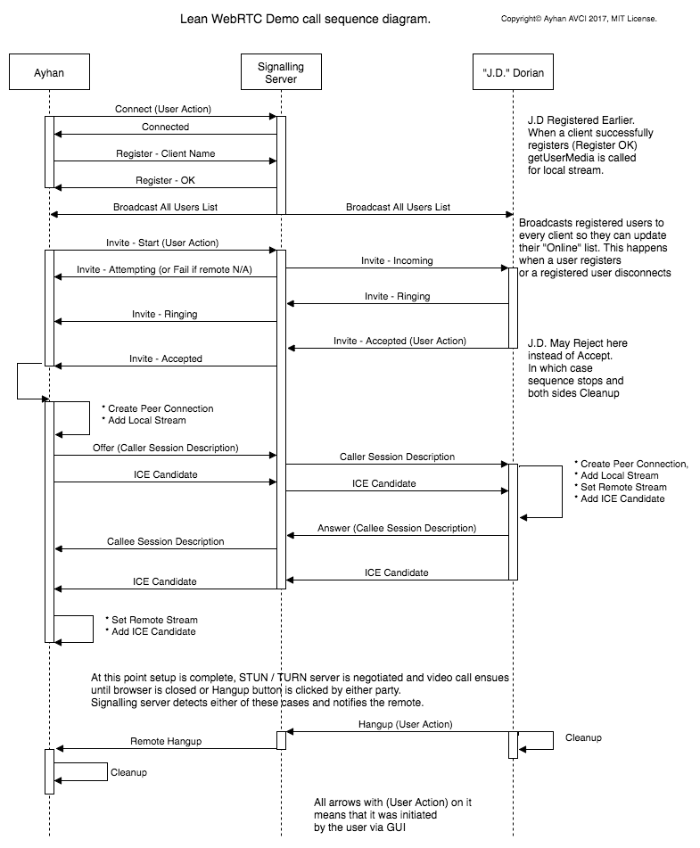
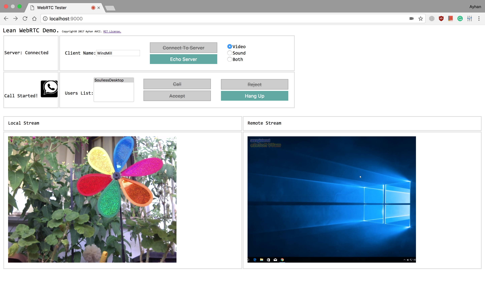

# Lean WebRTC-Phone

Few years ago, I was tasked with developing a web based video enabled Call Center for a customer. Back then, I had a rather short deadline so I used a third party library for it. I wanted to write my own library using the official API but that task has always been pushed back due to a torrent of priorities. But when I read webkit [announcing](https://webkit.org/blog/7726/announcing-webrtc-and-media-capture/) IPhone & Mac support is upon us, I decided to make some basic preperations for it. Coming from a low level CTI programmer (on C++ mostly) background, I felt the urge to add WebRTC to my collection. Most of the sample codes out there were either make-pretend (no proper signalling) or just huge. So i coded this little script. Anyone can feel free to use [the code](https://github.com/ayhanavci/LeanWebrtc).

My goals were;

* Video call with basic softphone features. (✓ Register, Call, Answer, Reject, Hangup, Ringing etc.)
* No external dependencies. (✓)
* Should only use the [official API](https://www.w3.org/TR/webrtc/) (✓)
* Should have a working signalling server.(✓)
* Should have a protocol. (✓ reduced SIP)
* Understandable, very simple dispatch mechanism. (✓)
* Should be as little code as possible. (✓ 500 lines client JS code, 250 lines server JS code)
* Well documented. (✓ Added a sequence diagram as well as this doc)
* Potentially provide a basis for any future production application I may need (✓)

## Structure

* Both Client.js and Server.js have dispatcher mechanisms, calling event handlers. onSocketMessage on client, processMessage on the server.
* A simple state mechanism is included on the client code. A production code should have proper dialogs similar to [SIP - rfc3261](https://www.ietf.org/rfc/rfc3261.txt)
* Variable and function names tend to be long in an attempt to be self explanatory. Almost everything is logged.  

## Technologies used

* WebSocket
* WebRTC (Promise based)
* Media Streams (Promise based)
* Node.js
* Javascript
* JSon for signalling

## How signalling in the code works

I always wanted to have an awkward conversation with JD from [Scrubs](http://www.imdb.com/title/tt0285403/). 

## Dependencies

* Zero dependencies nor external js libraries on client code. Native & unbloated code (Hence the name Lean).
* On the server side, I used [Node.js websockets library ws](http://websockets.github.io/ws/). I chose this library because it was a basic library fully compatible with [RFC 6455](https://tools.ietf.org/html/rfc6455). So it has no fancy room mechanisms like [socket.io](https://socket.io/) has. Any random websocket library should do the job since I only used basic features.

## Prerequisites 

* [Node.js](https://nodejs.org/en/) - Node.js® javascript runtime. I used v6.11.3.
* Any WebRTC supporting browser. You can check [WebRTC.org](https://webrtc.org/) for a list of supported browsers. 
* A web server to host index.html.

## Installing

* Install Node.js

**Setup signalling server**

* From the console, CD to server path and run "npm install" to install node modules (just websockets)
* Run "node server.js". By default it runs on 8080 port. Edit top of the Server.js file if you want to change it.

**Setup client**

* Edit Client.js to change signallingServer (it is on top of the file) IP address and port to the server you are hosting.
* You will need to host index.html. WebRTC won't work if you simply navigate to the file index.html.
I used [Web Server for Chrome](https://chrome.google.com/webstore/detail/web-server-for-chrome/ofhbbkphhbklhfoeikjpcbhemlocgigb?hl=en) which was great. If you have [Python](https://www.python.org/) installed, you can run "python -m SimpleHTTPServer [Port]" (replace port) from terminal for a basic web hosting. Anything should work really (IIS, Apache etc).

## Running the tests

Before you start, a lot will be going on the browser's debugger console and on the server console. So you may want to check those.

1. From the browser, navigate to your hosted index.html. 
2. Select what you want to transmit (default is Video only)
3. Enter a client name, click "Connect To Server". This connects client to signalling server, registers its name, broadcasts everyone that you have connected, opens your camera and gets the stream. Essentially you are ready to make a call.
4. Need more clients. So open additional browsers/tabs and navigate to index.html. Repeat processes 1-2-3 for each client. This should populate "Users List" on every user's screen since signalling server broadcasts its phone book when a new user registers or closes. Users List will NOT display your own user name since it would be weird to call yourself.
5. Select a user from Users List and click Call button. This will enable Hangup button so you can end the call whenever.
6. The person you have called should see Ringing. This will enable Accept, Reject and Hangup options while disabling Call option for the callee.
7. Callee accepts the call and the conversation begins. Either party can Hangup.

I ran all the tests on LAN without firewall between peers. You may want to find or host a good STUN / TURN server if you want to test behind firewalls as it is the case in production. In the code, stun:stun.l.google.com:19302 is used.

This is how it looks like. The one on the left is my notebook's camera, the one on the right is Chrome running on Windows 10 running on [Virtualbox](https://www.virtualbox.org) with a virtual cam driver streaming the desktop. Also, I'm not going to put my unshaved face here. Instead, take a look at the windmill at my terrace.

##Tested browsers

* In my tests I used [Chrome](https://www.google.com/chrome/browser/desktop/index.html) (Version 61.0.3163.91) on Mac & Windows. [Firefox](https://www.mozilla.org/en-US/firefox/new/) (Version 55.0.3) on Mac. [Opera](http://www.opera.com/) (Version 47.0.2631.80). All of which worked fine out of the box without any need of rtc browser prefixes in the code whatsoever. Should work on Android too. 

* According to this [WebKit public announcement](https://webkit.org/blog/7726/announcing-webrtc-and-media-capture/). It is soon coming to Safari on IOS and Mac.

* **WARNING: getUserMedia requires secure connection to initiate unless you connect to localhost.** You can test it on localhost or run chrome with "--unsafely-treat-insecure-origin-as-secure="[your server]:[port]" --user-data-dir=[test dir]". Remember to replace "your server and "your port" properly and some local directory as "test dir".  Opera works on localhost and otherwise requires secure connection too. Firefox should pose no problems working on localhost **AND** local network without any need of hocus pocus. 

## Authors

* **Ayhan Avcı** - [Linkedin](https://www.linkedin.com/in/ayhan-avci-pmp-pmi-acp-1a95365/)

## License

This project is licensed under the [MIT License](https://opensource.org/licenses/MIT) - see the [LICENSE.md](https://github.com/ayhanavci/LeanWebrtc/blob/master/docs/LICENSE.md) file for details

## History
#### **0.1.0**
* Signalling mechanism is designed and implemented
* WebRTC mechanisms implemented. 

## To Do
* Add some simple SIP Dialog
* Design a good GUI
* Develop security against injections
* Test on Android & Iphone
* Add custom STUN / TURN servers

## References

* [W3C WebRTC reference](https://www.w3.org/TR/webrtc/)
* [WebRTC.org starting point](https://webrtc.org/start/)
* [WebSocket RFC](https://tools.ietf.org/html/rfc6455)
* [Session Initiation Protocol RFC](https://www.ietf.org/rfc/rfc3261.txt)
* [Mozilla WebRTC API](https://developer.mozilla.org/en-US/docs/Web/API/WebRTC_API) - Great resource. Up to date.
* [WebRTC Adapter](https://github.com/webrtc/adapter) - Google documents keep talking about this to handle API differences on browsers. But this library is not needed since I used promise-based API. See official announcement [here](https://webrtc.org/web-apis/interop/).
* [Node.js](https://nodejs.org/en/)
* [WebKit public announcement](https://webkit.org/blog/7726/announcing-webrtc-and-media-capture/) - WebRTC on Apple platforms.
* [Google codelab](https://codelabs.developers.google.com/codelabs/webrtc-web/#0) and its [WebRTC samples](https://webrtc.github.io/samples/) - A lot of code in here are outdated. Awkward since it is WebRTC official git.
* Coded using [Visual Studio Code](https://code.visualstudio.com/)
* [VCam](http://www.e2esoft.cn/vcam/) Virtual video cam device. Great for testing. I ran this on my windows machine to stream my desktop to the browser on my Mac using Lean WebRTC :)
* I used [Draw.io](https://www.draw.io/) for the sequence diagram. Great tool.
